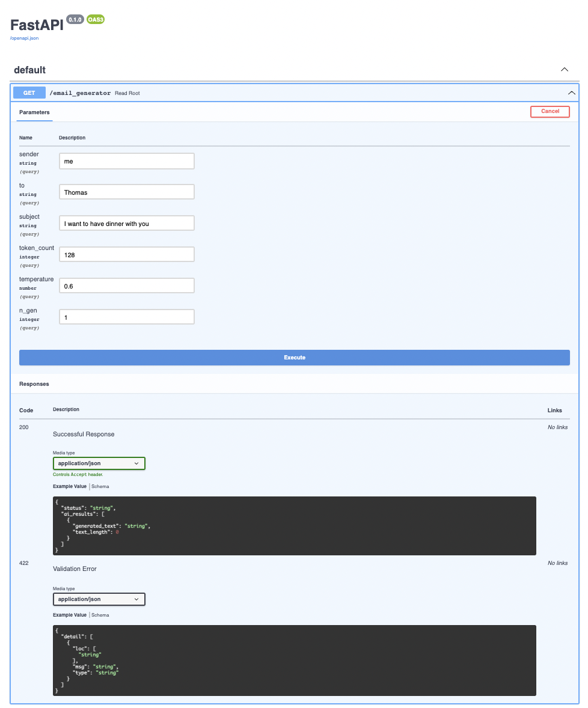
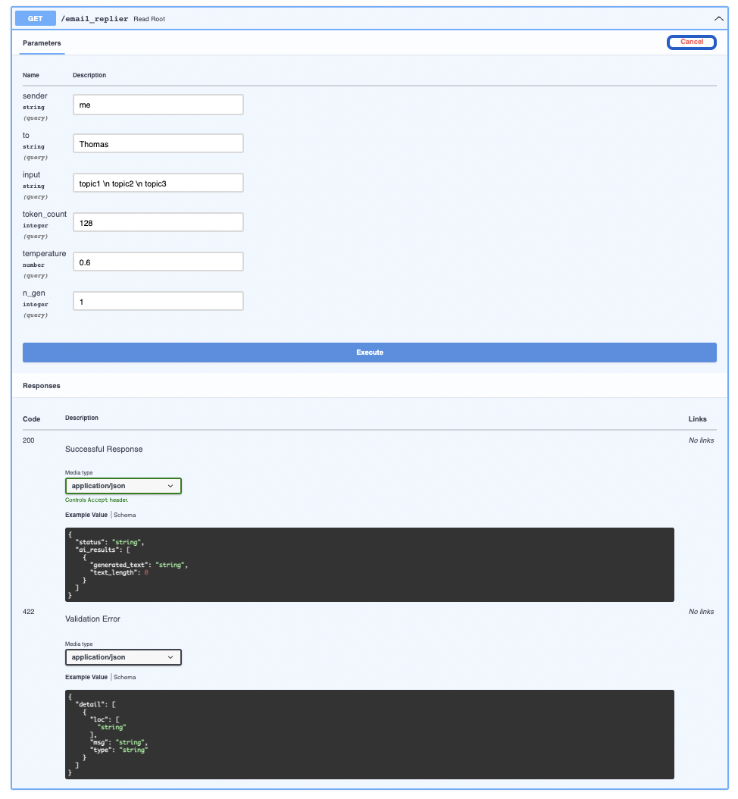

## Email Generator
This API uses 
* FAST API https://fastapi.tiangolo.com/ 
* Swagger UI accessible by http://0.0.0.0:8080/docs
* Hugginface https://huggingface.co/
* API Config. The behaviour of the API can be controlled via the Config class on a model or a pydantic dataclass https://pydantic-docs.helpmanual.io/usage/model_config/.

The base model is GPT2 and, it was finetuned with this dataset https://dataverse.harvard.edu/dataset.xhtml?persistentId=doi:10.7910/DVN/28204


The fine-tuned model is available at https://huggingface.co/vwoloszyn/gtp2-email

### Docker
```shell
docker build -t myimage .
docker run --name mycontainer -p 8080:8080 myimage
```

### Locally 
```shell
pip install -r requirements.txt
uvicorn app.main:app --host 0.0.0.0 --port 8080 --reload
```

### Training a new model
The notebooks for training is available here: 
https://github.com/vwoloszyn/email_generator/blob/main/train/train.ipynb

## Generating Email
Go to http://0.0.0.0:8080/docs, fill up the parameters and click "execute"


## Replaying Email
Go to http://0.0.0.0:8080/docs, fill up the parameters and click "execute"
